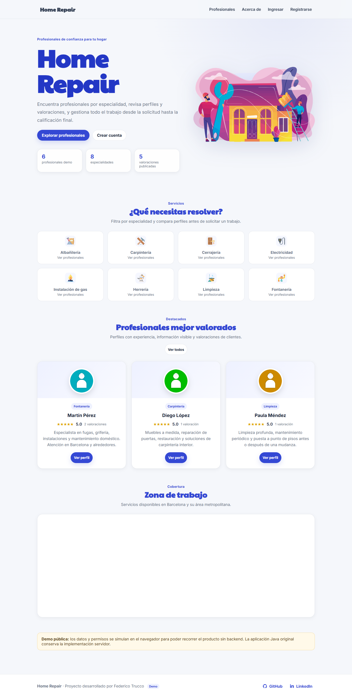
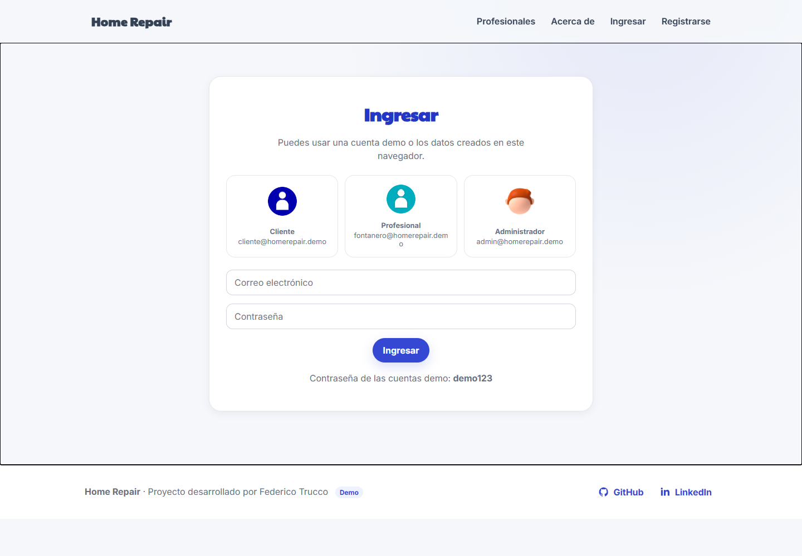
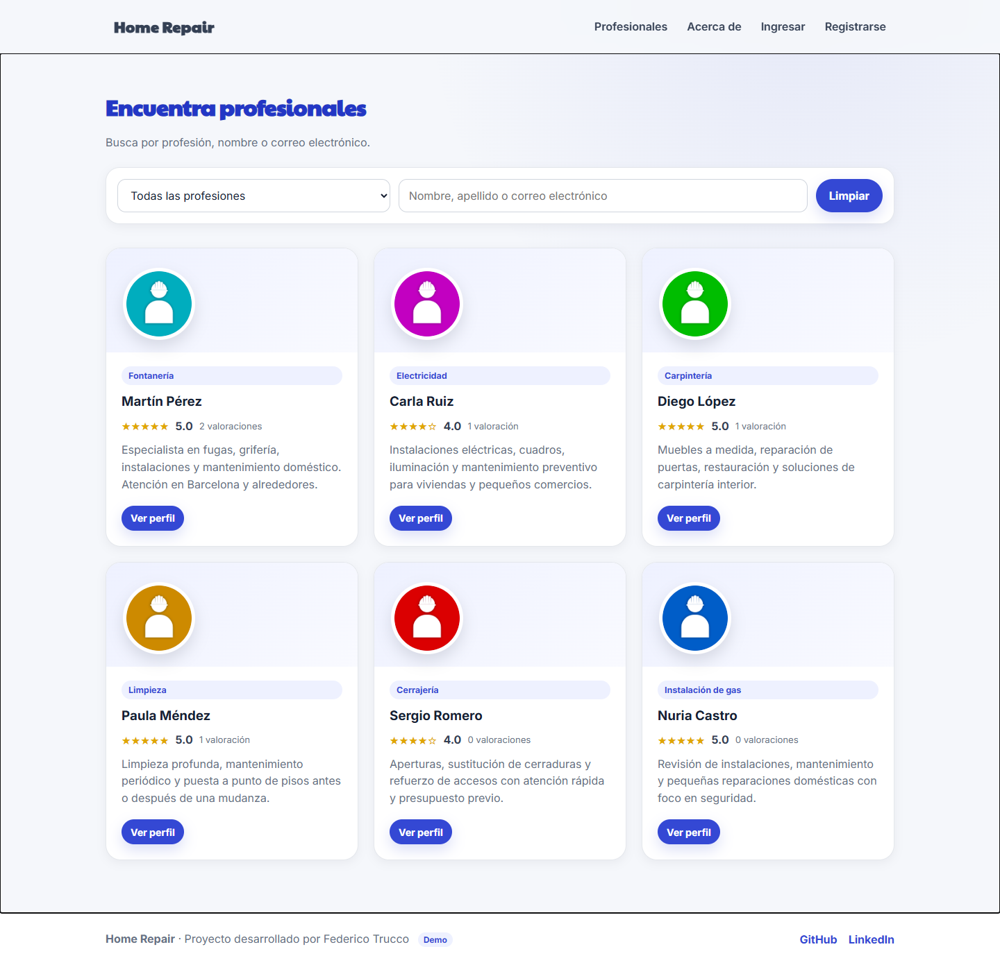
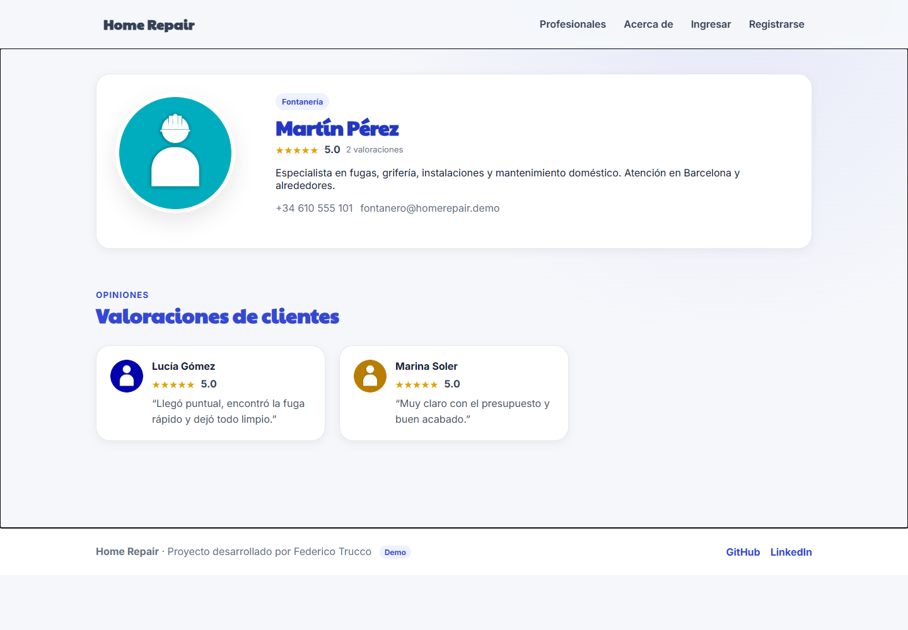
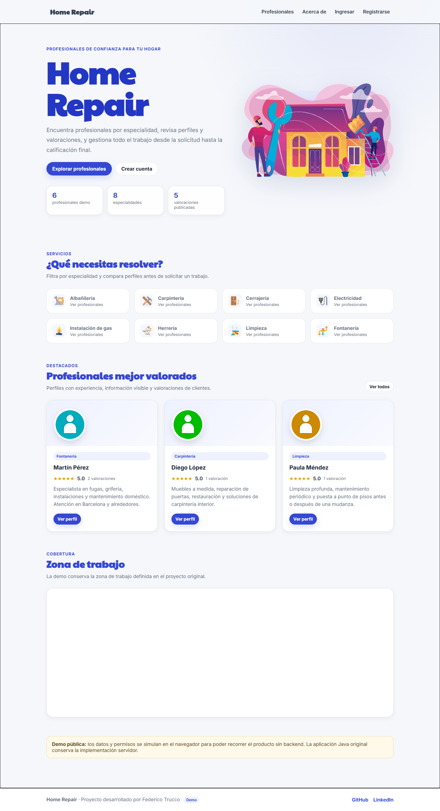

# 🛠️ Home Repair

### Plataforma para conectar clientes con profesionales de reparaciones del hogar

[**Demo**](https://truquinio.github.io/home-repair/) ·
[**UX/UI y accesibilidad**](docs/UX_UI_ACCESSIBILITY.md) ·
[**Código**](https://github.com/truquinio/home-repair)

---

## 👀 De un vistazo

Home Repair modela un marketplace de servicios domésticos con tres perfiles principales:

- 👤 **Cliente** — busca profesionales y gestiona solicitudes.
- 🧑‍🔧 **Profesional** — mantiene su perfil y trabaja con solicitudes.
- 🛡️ **Administrador** — dispone de funciones de gestión.

El repositorio conserva el backend original en Java/Spring Boot y una **demo frontend independiente** para poder explorar el producto directamente desde GitHub Pages.

> [!NOTE]
> La demo usa localStorage. Autenticación, autorización y persistencia están simuladas y no sustituyen Spring Security ni MySQL.

## 📸 Vista previa

  

<strong>Ver galería completa</strong>

 

| Inicio de sesión | Profesionales |
| --- | --- |
|  |  |

| Perfil profesional | Administración |
| --- | --- |
|  |  |

## ✨ Funcionalidades

- registro e inicio de sesión;
- roles Cliente, Profesional y Administrador;
- perfiles de clientes y profesionales;
- búsqueda y filtrado por especialidad;
- solicitudes de trabajo y cambios de estado;
- reseñas y valoraciones;
- gestión administrativa;
- carga y visualización de imágenes.

## 🏗️ Arquitectura

~~~mermaid
flowchart LR
    U["Usuario"] --> T["Thymeleaf / Frontend"]
    T --> W["Spring MVC"]
    W --> S["Servicios"]
    S --> J["Spring Data JPA"]
    J --> DB[("MySQL")]
    W --> SEC["Spring Security"]
    D["Demo GitHub Pages"] --> LS[("localStorage")]
~~~

| Área | Tecnologías |
| --- | --- |
| Backend | Java 17 · Spring Boot 2.7.18 · Spring Security |
| Datos | Spring Data JPA · Hibernate · MySQL |
| Vistas | Thymeleaf · HTML · CSS · JavaScript · Bootstrap |
| Build | Maven |
| Demo | HTML · CSS · JavaScript · localStorage |
| Entrega | GitHub Actions · GitHub Pages |

## ▶️ Ejecutar el proyecto

<strong>Backend Java</strong>

### Requisitos

- Java 17
- MySQL
- Maven Wrapper

~~~text
DB_URL=jdbc:mysql://localhost:3306/home_repair
DB_USERNAME=tu_usuario
DB_PASSWORD=tu_password
~~~

Linux/macOS:

~~~bash
./mvnw spring-boot:run
~~~

Windows:

~~~powershell
.\mvnw.cmd spring-boot:run
~~~

<strong>Demo estática local</strong>

Linux/macOS:

~~~bash
rm -rf public
mkdir -p public/img
cp demo/index.html demo/styles.css demo/app.js public/
cp -R src/main/resources/static/img/. public/img/
python -m http.server 8080 --directory public
~~~

Windows PowerShell:

~~~powershell
Remove-Item public -Recurse -Force -ErrorAction SilentlyContinue
New-Item -ItemType Directory -Force public/img | Out-Null
Copy-Item demo/index.html,demo/styles.css,demo/app.js public/
Copy-Item src/main/resources/static/img/* public/img/ -Recurse
python -m http.server 8080 --directory public
~~~

## 🔑 Cuentas de demostración

| Rol | Email | Contraseña |
| --- | --- | --- |
| Cliente | cliente@homerepair.demo | demo123 |
| Profesional | fontanero@homerepair.demo | demo123 |
| Administrador | admin@homerepair.demo | demo123 |

Son credenciales exclusivamente de la simulación frontend.

## ♿ UX/UI y accesibilidad

El proyecto documenta criterios de navegación por teclado, contraste, formularios, targets táctiles, responsive design y prefers-reduced-motion.

El objetivo declarado es **WCAG 2.2 AA**; no se presenta como una certificación independiente.

📘 [Ver documentación](docs/UX_UI_ACCESSIBILITY.md)

## 🧪 CI/CD

.github/workflows/ci-pages.yml ejecuta tests Maven, valida la demo estática y despliega GitHub Pages desde main.

## 🔒 Seguridad

Las credenciales reales de base de datos se proporcionan mediante configuración externa y no deben versionarse.

## 📜 Licencia

El código de este proyecto se publica bajo la [Licencia MIT](LICENSE).

---

**Federico Trucco / [@truquinio](https://github.com/truquinio)** · [LinkedIn](https://www.linkedin.com/in/federico-trucco/)
